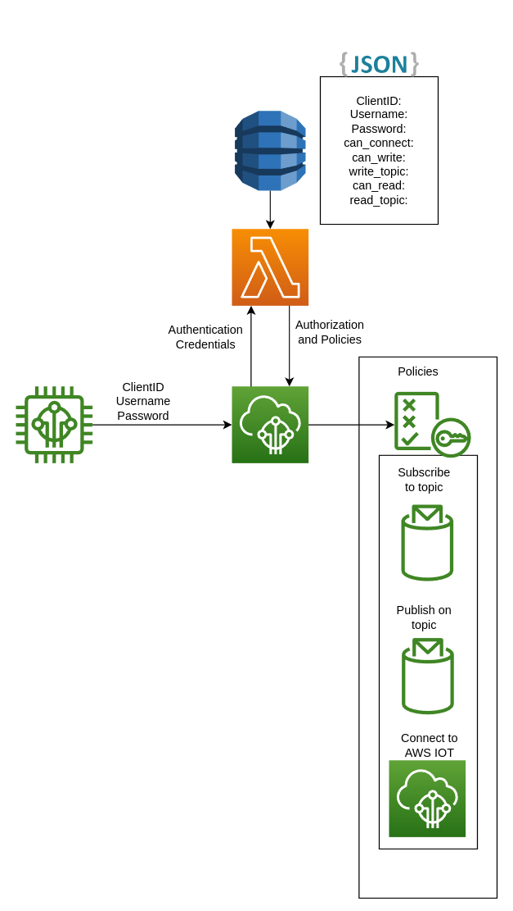
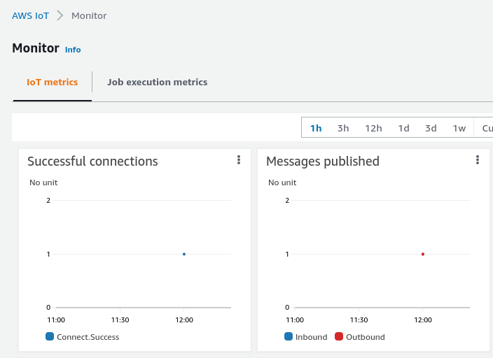

# Link to Repo
[If you want to skip the article, code and cloudformation documents as well as minimal instructions are located here.](https://github.com/SrzStephen/python-aws-iot-custom-authorizer)


# Background
There are some cases where using the standard [x509 certificate based authentication](https://docs.aws.amazon.com/iot/latest/developerguide/x509-client-certs.html)
can be a bit of a pain for some IOT use cases - A great example of this is if you want to integrate
[Tasmota](https://tasmota.github.io/docs/AWS-IoT/#1-prerequisites) with AWS IOT.

AWS provided an alternate way to authenticate called Custom Authentication, using
an [AWS IOT Custom Authorizer](https://docs.aws.amazon.com/iot/latest/developerguide/custom-authentication.html).
This essentially allows you to use standard MQTT username and password authentication. To use this, you must implement your
own AWS Lambda function to control your `authentication` (is this combination of client/username/password correct) and `authorization`
(what set of [AWS IOT Policies](https://docs.aws.amazon.com/iot/latest/developerguide/iot-policies.html) you should have).

## Issues I faced

When I was trying to get this going, I ran into a few issues:

1. The [official documentation](https://docs.aws.amazon.com/iot/latest/developerguide/custom-authentication.html) had a lot of
"Run this CLI command" instructions without really going into a lot of depth.
2. There was minimal information out there for how to connect using a real world client which made it difficult to try to figure
out why things weren't working.
3. To compound #3, some open source information out there is very out of date (partly due to ATS endpoint changes made by AWS)
which lead to me burning a lot of time trying things that had no chance of working.
4. I couldn't find a single cloudformation'd example for how to run it that I could tweak for my own purposes.

Part of the reason for me writing this post is to try to document what I did, what problems I ran into
and provide more of an end-to-end solution along with connection details to help others avoid running into the same
issues that I ran into.


# Implementation

I chose to use [AWS SAM](https://aws.amazon.com/serverless/sam/) to simplify the deployment of my pipeline, creating
[This SAM Template](https://github.com/SrzStephen/python-aws-iot-custom-authorizer/blob/main/template.yaml) with the goal
of deploying a serverless design so that it would have minimal cost at the sort of scale that my personal
project run at, and would require zero maintenance on my end.

The Lambda Authorizer sees the following data from a client trying to connect via MQTT.

```json
{
  "protocolData": {
    "mqtt": {
      "username": "USER_NAME",
      "password": "PASS_WORD",
      "clientId": "CLIENT_NAME"
    }
  },
  "protocols": [
    "mqtt"
  ],
  "signatureVerified": false,
  "connectionMetadata": {
    "id": "d0adaaa7-b22d-4545-923c-68a7ae2e337c"
  }
}
```

One thing that caused me some grief and is explicitly called out in the documentation: The password that comes in
via protocolData is base64 encoded, so you need to make sure to take this into account when writing unit tests, and
make sure that your comparison function is something like this:

```python {6}
def check_password(db_creds: DynamoModel, request_creds: MQTTData) -> bool:
    # Note, password comes in as base64 under normal circumstances
    return all(
        [
            db_creds.Username == request_creds.username,
            db_creds.Password == b64decode(request_creds.password).decode("utf-8"),
        ]
    )
```
Providing the ground truth for credentials as the code segment above implies is a DynamoDB table. The Table uses `Client_ID`
as a key, allowing me to say "if the client id doesn't exist in the table then it's unauthenticated, if it does exist
then validate the username and password supplied.

By making this decision I can have a very simple DynamoDB schema.
```yaml
  Table:
    Type: AWS::DynamoDB::Table
    Properties:
      KeySchema:
        - AttributeName: "Client_ID"
          KeyType: "HASH"
      AttributeDefinitions:
        - AttributeName: "Client_ID"
          AttributeType: "S"
      ProvisionedThroughput:
        ReadCapacityUnits: 1
        WriteCapacityUnits: 1
      TableName: "MQTTAuthTable"
```

I can then use this table to pull out a list of fields (including Username and Password) that I need for the Authorizer
to do its job.
```python
def get_details_for_client_id(client_id: str, table: Table) -> DynamoModel:
    return DynamoModel(
        **table.get_item(
            Key=dict(Client_ID=client_id),
            ProjectionExpression="Username, Password, AllowedTopic, allow_read, "
            "allow_connect, allow_write, read_topic, write_topic",
        )["Item"],
        Client_ID=client_id,
    )
```
The `return` of the Lambda Authorizer is a json object that should provide the authentication
status (`isAuthenticated`) and a list of roles that the client is authorized to assume (`policyDocuments`).

```json
{
  "isAuthenticated": true,
  "password": "PasswordHere",
  "principalId": "PrincipalHere",
  "disconnectAfterInSeconds": 3600,
  "refreshAfterInSeconds": 3600,
  "policyDocuments": [
    {
      "Version": "2012-10-17",
      "Statement": [
        {
          "Action": "iot:Connect",
          "Effect": "Allow",
          "Resource": "arn:aws:iot:ap-southeast-2:MY_ID:client/CLIENT_ID"
        },
        {
          "Action": "iot:Receive",
          "Effect": "Allow",
          "Resource": "arn:aws:iot:ap-southeast-2:MY_ID:topic/integration/cbb38fe8/read"
        },
        {
          "Action": "iot:Subscribe",
          "Effect": "Allow",
          "Resource": "arn:aws:iot:ap-southeast-2:MY_ID:topicfilter/integration/cbb38fe8/read"
        },
        {
          "Action": "iot:Publish",
          "Effect": "Allow",
          "Resource": "arn:aws:iot:ap-southeast-2:MY_ID:topic/integration/cbb38fe8/write"
        }
      ]
    }
  ]
}
```

The `_topic` and `allow_` attributes pulled from the DynamoDB table control the generation of the Actions that
the client is able to assume (`iot:Publish` `iot:Subscribe` `iot:Receive` `iot:Connect`) and the Resources
that it's able to use those actions on.

The authorization route ends up looking like the [AWS provided custom authentication workflow diagram](https://docs.aws.amazon.com/iot/latest/developerguide/custom-authorizer.html)
but with the addition of a DynamoDB table for storage of credentials and roles.



The deployed SAM template for this example ends up being pretty short.

```yaml
AWSTemplateFormatVersion: '2010-09-09'
Transform: AWS::Serverless-2016-10-31
Description: >
  AWS IOT Custom Authorizer with Python 3.9+ using AWS SAM
Globals:
  Function:
    Timeout: 3

Resources:

  UnsignedAuthorizerPermission:
    Type: AWS::Lambda::Permission
    Properties:
      Action: lambda:InvokeFunction
      Principal: iot.amazonaws.com
      SourceArn: !GetAtt  UnsignedAuthorizer.Arn
      FunctionName: !GetAtt AuthFunction.Arn

  AuthFunction:
    Type: AWS::Serverless::Function
    Properties:
      CodeUri: src/authorizer
      Handler: authorizer.app.lambda_handler
      Runtime: python3.9
      Architectures:
        - x86_64
      Environment:
        Variables:
          AWS_ACCOUNT_ID: !Sub ${AWS::AccountId}
          DYNAMO_TABLE_NAME: !Ref Table
      Policies:
        - Version: "2012-10-17"
          Statement:
            - Effect: Allow
              Action:
                - "dynamodb:Get*"
                - "dynamodb:Query"
              Resource: !GetAtt Table.Arn
  Table:
    Type: AWS::DynamoDB::Table
    Properties:
      KeySchema:
        - AttributeName: "Client_ID"
          KeyType: "HASH"
      AttributeDefinitions:
        - AttributeName: "Client_ID"
          AttributeType: "S"
      ProvisionedThroughput:
        ReadCapacityUnits: 1
        WriteCapacityUnits: 1
      TableName: "MQTTAuthTable"

  UnsignedAuthorizer:
    Type: AWS::IoT::Authorizer
    Properties:
      AuthorizerFunctionArn: !GetAtt AuthFunction.Arn
      AuthorizerName: "MqttAuth-Unsigned"
      EnableCachingForHttp: true
      SigningDisabled: True
      Status: "ACTIVE"

Outputs:
  UnsignedAuthorizerName:
    Description: "Name of unsigned authorizer"
    Value: !Ref UnsignedAuthorizer

  UnsignedAuthorizerStatus:
    Description: "Unsigned authorizer active. Currently a placeholder value to be used when I create a secure authorizer"
    Value: true

  TableName:
    Description: "Table name that stores AWS Authorizer Credentials"
    Value: !Ref Table
```

The SAM template can be deployed by installing [AWS CLI](https://docs.aws.amazon.com/cli/latest/userguide/getting-started-install.html),
[AWS SAM](https://docs.aws.amazon.com/serverless-application-model/latest/developerguide/serverless-sam-cli-install.html)
and running
```bash
sam build
sam deploy --guided
```

There are some tests in `tests/integration` that help validate that the deployment is
successful, these make heavy use of [pytest fixtures](https://docs.pytest.org/en/7.1.x/how-to/fixtures.html)
to keep the tests [DRY](https://www.digitalocean.com/community/tutorials/what-is-dry-development).

## Connecting via the Authorizer
The best example for how to connect are the Integration tests that are provided in
`test/integration` as they include working examples  with the `test_invoke_authorizer` command
to validate the authorizer works, as well as examples for [Paho MQTT](https://pypi.org/project/paho-mqtt/)
and [AWS IOT SDK V2](https://github.com/aws/aws-iot-device-sdk-python-v2). It's likely that you'lll need to set
the `STACK_NAME` environment variable to the name of your stack so that it can find your resources.

The main things to remember when connecting with a real client with a fair few listed in the [guide](https://docs.aws.amazon.com/iot/latest/developerguide/custom-auth.html):
* You will need to truncate `?x-amz-customauthorizer-name=` to your username.
* You will need to include an ['ALPN'](https://en.wikipedia.org/wiki/Application-Layer_Protocol_Negotiation)
of MQTT.
* You will need to ensure you trust the [AWS IOT V3 CA Certificate](https://docs.aws.amazon.com/iot/latest/developerguide/server-authentication.html).
* You will need to be using the `ATS` endpoint, which you can find with the command `aws iot describe-endpoint --endpoint-type "iot:Data-ATS"`.
* You will need to be connected to port 443 for MQTT authentication with a custom authorizer.

### Connecting with Paho (Python)
```:title=requirements.txt 
paho-mqtt==1.6.1
```
Example connection code
```python
from urllib.request import urlretrieve
from urllib.parse import quote_plus
from pathlib import Path
import ssl
import paho.mqtt.client as mqtt

# client_id = YOU_NEED_TO_SET
# username = YOU_NEED_TO_SET
# password = YOU_NEED_TO_SET
# aws_endpoint = YOU_NEED_TO_SET
# authorizer_name = YOU_NEED_TO_SET

# Download CA certificate
aws_ca = Path(__file__).parent / "awsCA.pem"
urlretrieve("https://www.amazontrust.com/repository/AmazonRootCA1.pem",aws_ca)

# Create client
mqtt_client = mqtt.Client(client_id=client_id)

# Setup SSL
ssl_context = ssl.create_default_context()
ssl_context.set_alpn_protocols(["mqtt"])
ssl_context.load_verify_locations(aws_ca)

# Setup Client
mqtt_client.tls_set_context(context=ssl_context)
mqtt_client.username_pw_set(
    username=f"{username}?x-amz-customauthorizer-name={quote_plus(authorizer_name)}"
    password=password
)
# Connect
mqtt_client.connect(host=aws_endpoint, port=443, keepalive=60)
```
From here I'd suggest looking at [Steves-internet-guide](http://www.steves-internet-guide.com/into-mqtt-python-client/)
for more information on publishing and subscribing using Paho.

### Connecting and Publishing with AWS IOT SDK V2 (Python)
Thankfully this is a LOT easier as AWS provide a [direct_with_custom_authorizer](https://github.com/aws/aws-iot-device-sdk-python-v2/blob/main/awsiot/mqtt_connection_builder.py#L451)
function that does most of the heavy lifting for you.

```:title=requirements.txt
awsiotsdk==1.11.3
```
Example connection code
```python
from awscrt.mqtt import Connection, QoS
from awsiot.mqtt_connection_builder import direct_with_custom_authorizer

# client_id = YOU_NEED_TO_SET
# username = YOU_NEED_TO_SET
# password = YOU_NEED_TO_SET
# aws_endpoint = YOU_NEED_TO_SET
# authorizer_name = YOU_NEED_TO_SET

# Download CA certificate
aws_ca = Path(__file__).parent / "awsCA.pem"
urlretrieve("https://www.amazontrust.com/repository/AmazonRootCA1.pem",aws_ca)

aws_iot_connection = direct_with_custom_authorizer(
    auth_username=username,
    auth_authorizer_name=authorizer_name,
    auth_password=password,
    **dict(
        endpoint=aws_endpoint,
        client_id=test_client,
        ca_filepath=aws_ca.absolute().__str__(),
        port=443),
        )
connect_future = aws_iot_connection.connect()
connect_future.result(timeout=20)
```
Once your connection_future returns successfully, it's trivial to start
using the [examples](https://github.com/aws/aws-iot-device-sdk-python-v2/blob/main/samples/pubsub.py)
to see how to subscribe/publish.

### Connecting and Publishing with C++ (PubSubClient) - ESP32/ESP8266/Arduino
As with all arduino/esp32/esp8266 things, I highly suggest [using platformio with vs code](https://platformio.org/install/ide?install=vscode)
as using a full-featured IDE makes your life a lot easier.

I have a link to a full example in my [repo](https://github.com/SrzStephen/python-aws-iot-custom-authorizer/tree/main/arduino_connect_example)
but as a summary.

I like to split up constants like passwords into their own header file.

```c:title=lib/secrets/secrets.h
const char* wifi_name = "";
const char* wifi_pass = "";
const char* mqtt_username = "";
const char* mqtt_password = "";
const char* mqtt_client_id = "";
const char* mqtt_ats_endpoint = "";
const char* mqtt_custom_authorizer_name= "";
const char* mqtt_publish_topic = "";

// the AWS IOT CA certificate isn't a secret
// It's in here for convenience
const char CA_CERT[] = R"EOF(-----BEGIN CERTIFICATE-----
MIIDQTCCAimgAwIBAgITBmyfz5m/jAo54vB4ikPmljZbyjANBgkqhkiG9w0BAQsF
ADA5MQswCQYDVQQGEwJVUzEPMA0GA1UEChMGQW1hem9uMRkwFwYDVQQDExBBbWF6
b24gUm9vdCBDQSAxMB4XDTE1MDUyNjAwMDAwMFoXDTM4MDExNzAwMDAwMFowOTEL
MAkGA1UEBhMCVVMxDzANBgNVBAoTBkFtYXpvbjEZMBcGA1UEAxMQQW1hem9uIFJv
b3QgQ0EgMTCCASIwDQYJKoZIhvcNAQEBBQADggEPADCCAQoCggEBALJ4gHHKeNXj
ca9HgFB0fW7Y14h29Jlo91ghYPl0hAEvrAIthtOgQ3pOsqTQNroBvo3bSMgHFzZM
9O6II8c+6zf1tRn4SWiw3te5djgdYZ6k/oI2peVKVuRF4fn9tBb6dNqcmzU5L/qw
IFAGbHrQgLKm+a/sRxmPUDgH3KKHOVj4utWp+UhnMJbulHheb4mjUcAwhmahRWa6
VOujw5H5SNz/0egwLX0tdHA114gk957EWW67c4cX8jJGKLhD+rcdqsq08p8kDi1L
93FcXmn/6pUCyziKrlA4b9v7LWIbxcceVOF34GfID5yHI9Y/QCB/IIDEgEw+OyQm
jgSubJrIqg0CAwEAAaNCMEAwDwYDVR0TAQH/BAUwAwEB/zAOBgNVHQ8BAf8EBAMC
AYYwHQYDVR0OBBYEFIQYzIU07LwMlJQuCFmcx7IQTgoIMA0GCSqGSIb3DQEBCwUA
A4IBAQCY8jdaQZChGsV2USggNiMOruYou6r4lK5IpDB/G/wkjUu0yKGX9rbxenDI
U5PMCCjjmCXPI6T53iHTfIUJrU6adTrCC2qJeHZERxhlbI1Bjjt/msv0tadQ1wUs
N+gDS63pYaACbvXy8MWy7Vu33PqUXHeeE6V/Uq2V8viTO96LXFvKWlJbYK8U90vv
o/ufQJVtMVT8QtPHRh8jrdkPSHCa2XV4cdFyQzR1bldZwgJcJmApzyMZFo6IQ6XU
5MsI+yMRQ+hDKXJioaldXgjUkK642M4UwtBV8ob2xJNDd2ZhwLnoQdeXeGADbkpy
rqXRfboQnoZsG4q5WTP468SQvvG5
-----END CERTIFICATE-----)EOF";
```

Your main function would then look something like
```c:title=src/main.cpp {3-7}
#include <Arduino.h>
#include <secrets.h>
#ifdef ESP32
#include <WiFi.h>
#elif defined(ESP8266)
#include <ESP8266WiFi.h>
#endif
#include <WiFiClientSecure.h>
#include <PubSubClient.h>
WiFiClientSecure secure_client = WiFiClientSecure();
PubSubClient mqttClient = PubSubClient(secure_client);
const char *aws_protos[] = {"mqtt", NULL};

String mqtt_modified_username(const char * username)
{
  // AWS requires x-amz-customauthorizer-name along with username
  // note the authorizer name needs to be URL encoded if you use special characters.
  return String(username) + String("?x-amz-customauthorizer-name=") 
  + String(mqtt_custom_authorizer_name);
}
void setup_wifi()
{
  WiFi.begin(wifi_name, wifi_pass); 
  while (WiFi.status() !=WL_CONNECTED )
   {
     Serial.println("Failed to connect to WiFi");
     Serial.println(WiFi.status());
     sleep(5);
   }
   Serial.println("Connected to WiFi");
}

void setup_mqtt()
{
  secure_client.setCACert(CA_CERT);
  secure_client.setAlpnProtocols(aws_protos);
  mqttClient.setSocketTimeout(10);
  mqttClient.setServer(mqtt_ats_endpoint,443);
  mqttClient.setKeepAlive(60);
  while(!mqttClient.connected())
  {

    mqttClient.connect(mqtt_client_id,mqtt_modified_username(mqtt_username).c_str(),mqtt_password);
      Serial.println("Failed to connect to MQTT");
      sleep(5);
  }
  Serial.println("Connected to MQTT");
}

void setup() {
  Serial.begin(9600);
  setup_wifi();
  setup_mqtt();
}

void loop() {
  sleep(200);
  mqttClient.publish(mqtt_publish_topic,testPublishString.c_str());
}
```
The highlighted rows are used to maintain compatibility between ESP32 and ESP8266 modules.


## Debugging steps
There are some pretty standard steps that you can go through to debug this:

### Run the Integration tests

If you're using the [provided repository](https://github.com/SrzStephen/python-aws-iot-custom-authorizer) then the
integration tests in `tests/integration` are pretty good validation for whether everything is working as intended.

### Check the Authorizer Lambda

Check your Lambda functions Invocations to check that it was called, and confirm whether that invocation provided any
errors.

If you're not seeing an invocation then it's likely you've got issues with your connection strings, either because
of your endpoint, not specifying an authorizer, not trusting the AWS Certificate, wrong port or possibly you've set
your IOT authorizer to [Status: "INACTIVE"](https://ap-southeast-2.console.aws.amazon.com/iot/home?region=ap-southeast-2#/authorizerhub).

### Check the Lambda returned message

Check whether the client was Authorized, and if not then check your username/password for the client.

If it was authorized then it's worth checking the returned policy and being mindful that not all
MQTT wildcard characters will behave as expected in AWS IOT.

The following table from AWS documentation is very useful to keep in mind.

| Wildcard character | Is MQTT wildcard character | Example in MQTT | Is AWS IoT Core policy wildcard character | Example in AWS IoT Core policies for MQTT clients |
| --- | --- | --- | --- | --- |
| \# | Yes | some/\# | No | N/A |
| \+ | Yes | some/\+/topic | No | N/A |
| \* | No | N/A | Yes | topicfilter/some/\*/topic  |
| ? | No | N/A | Yes |  `topic/some/?????/topic` `topicfilter/some/sensor???/topic`  |

### Check the AWS IOT console
The AWS monitor page is going to be very useful to check whether AWS IOT saw your connection.


If you're trying to debug whether publishing is working, it's worth using the MQTT test client in the AWS console to
subscribe to the topic that you're trying to publish to. Similarly, for testing subscriptions it might be useful to
use the MQTT test client to Publish a message on the topic that you're subscribed to.


